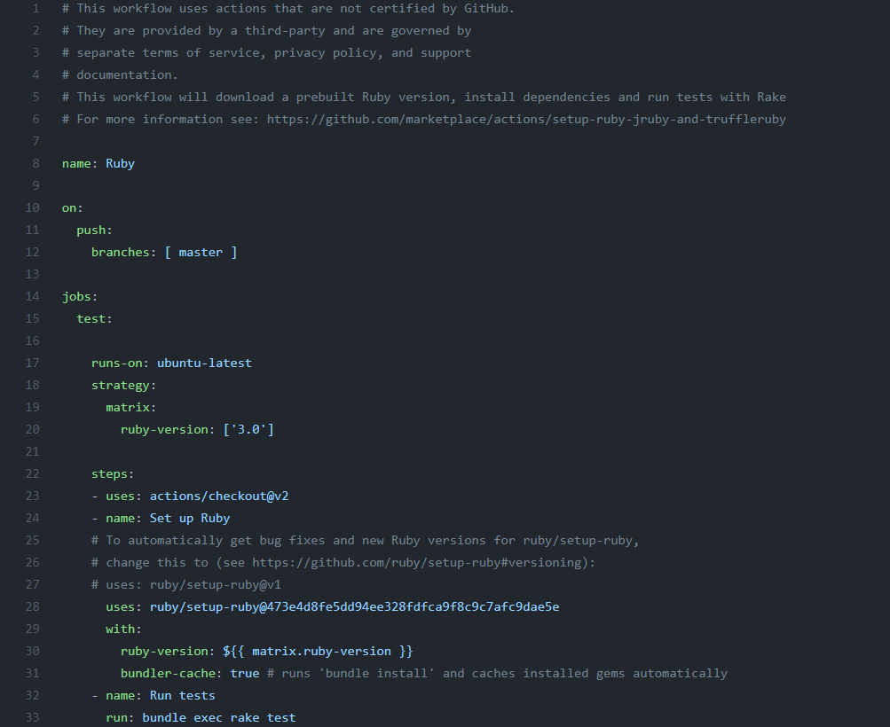

Adicionalmente se ha creado un actions en github para pasar los test al hacer un push. Para hacer esto nos hemos ido a la pestaña e **Actions** en la pantalla del repo. Después le hemos dado a crear new workflow, de los wqorkflows que nos proponen hemos cogido uno que se llama ruby, se ha escogido este ya que ejecuta los test desde un fichero Rakefile, por que un fichero Rakefile es nuestro fichero gestor de tareas y tiene una tarea para ejecutar los test.

Para crearlo nos ha llevado a una página donde teniamos el fichero de configuración configurado por defecto para ejecutar el fichero Rakefile. Hemos cogido este fichero y hemos copiado nuestro contenido en nuestra carpeta en local para crear nuestros workflows en gihub. Desde aquí lo hemos modificado para ejecutar las versiones de ruby que se querían ejecutar y cambiado el comando de ejecución.

El fichero de creación del nuevo workflow esta [aquí](https://github.com/CharlySM/ProyectoCC/blob/master/.github/workflows/testRuby.yml)

El contenido del fichero es este.

