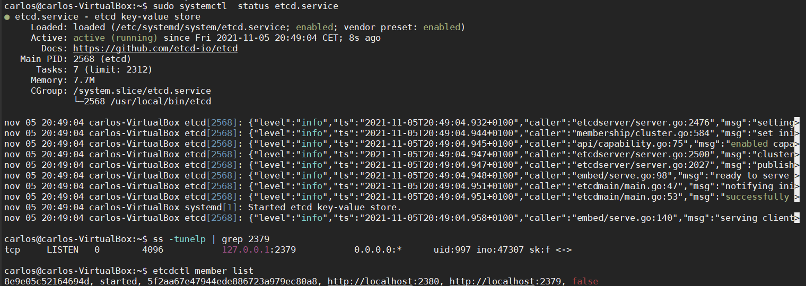

# Uso de buenas prácticas: configuración distribuida, logs.

Para usar la configuración distirbuida se ha usado el servicio etcd. Para usarlo primero se ha tenido que instalar siguiendo [esta](https://computingforgeeks.com/how-to-install-etcd-on-ubuntu-18-04-ubuntu-16-04/) guía.

Una vez instalado verificamos su estado con los comandos.

```
status etcd.service
```

Lanzamos el servicio en el puerto 2379.

```
ss -tunelp | grep 2379
```

Coprobamos que se ha lanzado.

```
etcdctl member list
```
 Mostramos la ejecución de los comandos lanzados anteriormente.

 

 Realizamos el export para que funcione correctamente el cliente.

 ```
 export ETCDCTL_API=3
 ```

Creamos el puerto para nuestra aplicación.

```
etcdctl put SinatraPort 80
```

Ahora cargamos el servicio en nuestra api, como se usa ruby instalamos la gema etcdv3, y lo añadimos como se ve el fichero [index.rb](https://github.com/CharlySM/ProyectoCC/blob/master/config.ru).

Para los loggin de nuestra aplicación vamos a usar el método que nos provée nuestra biblioteca de sinatra para poder escribir los logs. Este método es **Rack::CommonLogger**. Esta configuración del método se puede hacer tanto en un fichero config.ru como en el fichero de nuestra app sinatra. En mi caso lo he puesto en el fichero config.ru.

Primero cargamos el metodo con la linea:

```
require 'logger'
```

Tendremos creado un directorio log para guardar los ficheros generados por nuestro log. Sinatra ya mostraba por consola los logs que se generaban con el uso de la aplicación con esto estamos guardando esos logs en los ficheros correspondientes si es de error en un error.log si es de acceso en un access.log.

Primero configuramos nuestro método para que se creen los fichero donde se guardarán los logs.

```
::Logger.class_eval { alias :write :'<<' }
  access_log = ::File.join(::File.dirname(::File.expand_path(__FILE__)),'log','access.log')
  access_logger = ::Logger.new(access_log)
  error_logger = ::File.new(::File.join(::File.dirname(::File.expand_path(__FILE__)),'log','error.log'),"a+")
  error_logger.sync = true
```

Después asignamos la configuración hecha anteriormente al método.

```
configure do
  use ::Rack::CommonLogger, access_logger
end
```

Ahora añadimos unas lineas para que se asigne los logs emitidos por sinatra en consola en la variable de nuestro método esto lo escribirá en los ficheros correspondientes, la asignación se hace antes de que se ejecute nada de nuestra aplciación.

```
before {
  env["rack.errors"] =  error_logger
}
```

Referencias.

- [Logs ruby.](https://spin.atomicobject.com/2013/11/12/production-logging-sinatra/)
- [Servicio etcd.](https://computingforgeeks.com/how-to-install-etcd-on-ubuntu-18-04-ubuntu-16-04/)
