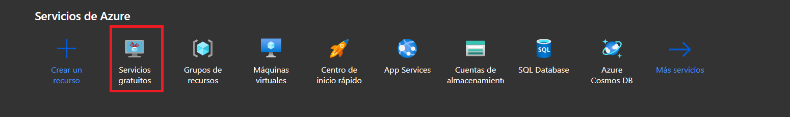
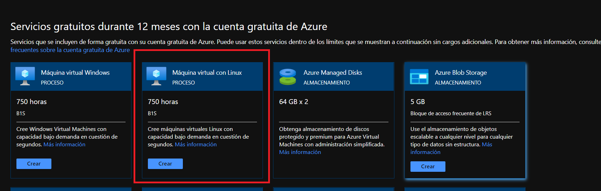
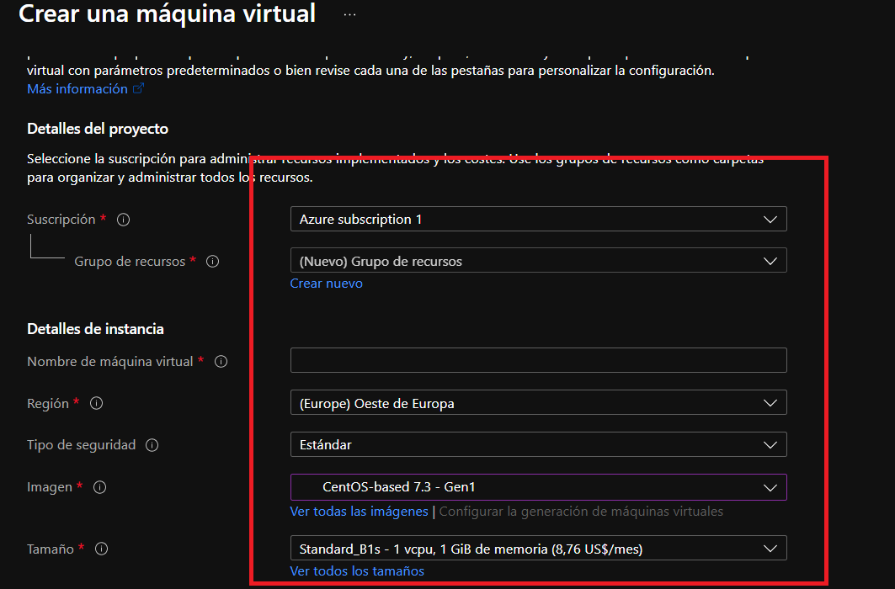
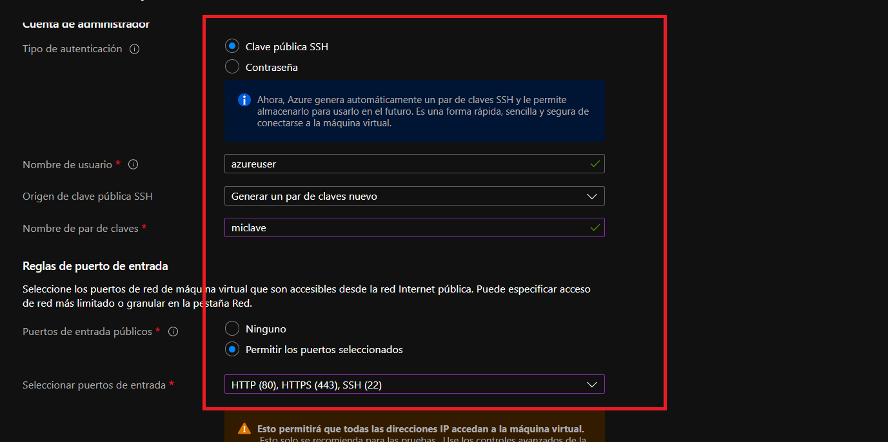

# Desplliegue de la aplicación en un servicio cloud.

Para desplegar la aplicación en un servicio cloud se ha mirado los distintos servicios que hay. En un primer lugar se pensó desplegar la aplicación en heroku, pero heroku no permite despliegues de una aplicación con docker-compose y que tenga varias imágenes. Después de eliminar heroku como una opción se miró si usar google cloud, o microsoft. Al final se uso microsoft ya que por mi experiencia laboral tengo conocimientos en la nube de microsoft azure.

Lo primero que se ha hecho es ingresar al [enlace](https://azure.microsoft.com/es-es/) de microsoft azure para darnos de alta en el servicio. Seleccionamos la opción **Cuenta Gratuita**, seleccionamos **empiece gratis**, después ingresamos nuestro correo y password y rellenamos todo lo que nos pide microsoft para poder empezar.

Una vez dentro de la plataforma azure dispondremos de 200$ durante 30 dias para probar microsoft azure.

Para el despliegue lo primero que hacemos es seleccionar la opción **servicios gratuitos**.



Una vez dentro seleccionamos máquinas virtuales con linux.



En un principio se pensó desplegar con ubuntu 16.04 de entre las opciones que había pero debido a probalemas de compatibilidad de la versión del sistema operativo y las versiones de los lenguajes, framework y conexiones a base de datos usados en el proyecto se tuvo que cambiar la elección. Al final la elección fue usar un sistema operativo **CentOS based 7.3**. Esto es debido a que la suscripción usada es gratuita, por lo tanto las opciones que hay para elegit el sistema operativo de la máquina virtual son limitadas y en algunos casos muy antiguas.

Para crear la máquina virtual lo que hacemos es rellenar los siguientes campos.





Rellenamos los campos nombre de la máquina, le asignamos un grupo de recursos existente, si no existe lo creamos nuevo desde esta misma pantalla. Elegimos el SO mencionado anteriormente(CentOS based 7.3). Activamos una clave ssh pública para poder conectar a nuestra máquina en remoto.Le damos nombre al par de claves. Abrimos los puertos para los dominios http y https, de esta forma podremos acceder exteriormente a nuestra aplicación cuando la despleguemos, desde la IP asignada.

Cuando le demos a crear y revisar nos dará la opción de descargar un fichero .pem que contendrá nuestra clave ssh para poder conecar en remoto, es necesario hacerlo en este paso ya que después no se podrá hacer.

Una vez iniciada vamos a configurar nuestro centos para poder desplegar nuestra aplicación con docker-compose. Primero lo que vamos a hace es instalar docker en nuestro sistema operativo, para ello usamos los siguientes comandos.

```
sudo yum install -y yum-utils

sudo yum-config-manager \
    --add-repo \
    https://download.docker.com/linux/centos/docker-ce.repo

sudo yum install docker-ce docker-ce-cli containerd.io
```

Esto lo podemos ver en este [enlace de docker.](https://docs.docker.com/engine/install/centos/)

Ahora vamos a instalar docker-compose para ello lanzamos los siguientes comandos.

```
sudo curl -L "https://github.com/docker/compose/releases/download/1.29.2/docker-compose-$(uname -s)-$(uname -m)" -o /usr/local/bin/docker-compose

sudo chmod +x /usr/local/bin/docker-compose

sudo ln -s /usr/local/bin/docker-compose /usr/bin/docker-compose
```

Esto lo podemos ver en este [enlace de docker](https://docs.docker.com/compose/install/)

Una vez hecho esto instalamos git para poder clonar nuestro repositorio.

```
yum install git
```

Esto lo podemos ver en este [enlace.](https://phoenixnap.com/kb/how-to-install-git-on-centos-7)

Levantamos nuestro servicio docker con el comando.

```
sudo systemctl start docker
```

Ahora lo único que tenemos que hacer es desplegar nuestra app lanzando el comnado.

```
sudo docker-compose up
```

Accedemos a nuestra api en la siguiente dirección.

[Despliegue](http://20.105.205.1/)
