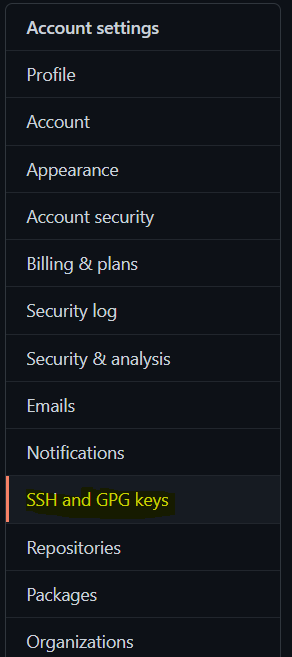
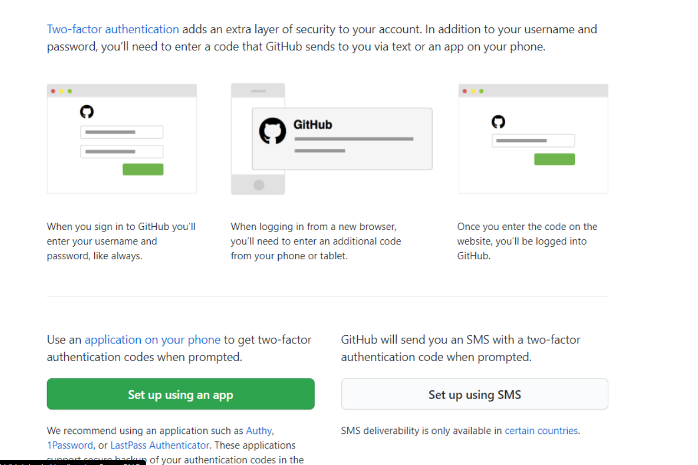

Se va a explicar los pasos seguidos para la creación del repositorio del proyecto.

# 1. Descarga de Git
  Se ha instalado git en un sistema operativo linux y se usan los comandos de git desde consola linux.

# 2. Creación de par de claves y subida de clave pública a GitHub.
  * Pimero creamos la clave pública como se indica en la documentación de [github](https://docs.github.com/es/github/authenticating-to-github/connecting-to-github-with-ssh/generating-a-new-ssh-key-and-adding-it-to-the-ssh-agent)
  * Después creamos la clave pública en github accediendo a settings -> ssh and GPG keys -> new ssh key.

  

  

  * Copiamos la clave pública creada en linux y acceptamos.

  

# 3. Configuración correcta del nombre y correo electrónico para que aparezca en los commits.
  Agregamos la dirección de correo electrónico para que aparezca en commits como se indica en la dcumentación de [github](https://docs.github.com/es/github/setting-up-and-managing-your-github-user-account/managing-email-preferences/setting-your-commit-email-address)
  Mostramos el correo para que aparezca en los commits.

  

# 4. Edición del perfil de GitHub para que aparezca una imagen en vez del avatar por omisión, nombre completo y ciudad, así como universidad.
  Esta parte se realizó en la asignatura de Infraestructura virtual del grado de ingeniería informática de la Univesidad de Granada.

# 5. Incrementar la seguridad de nuestra cuenta en GitHub activando el segundo factor de autenticación.
  * Primero vamos a Settings -> Account Security -> Enable Two factor authentication

  

  Lo activamos por app o por sms.

  * Activación.

  
