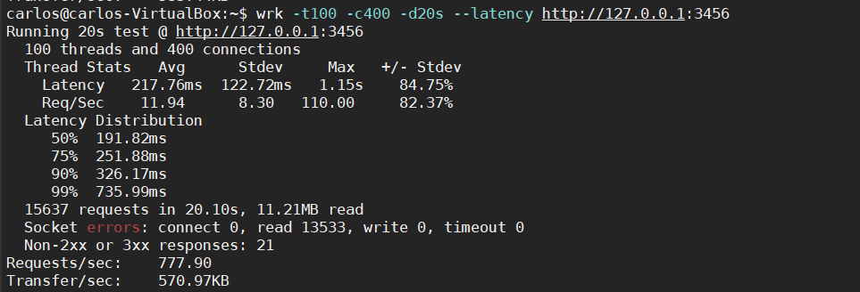
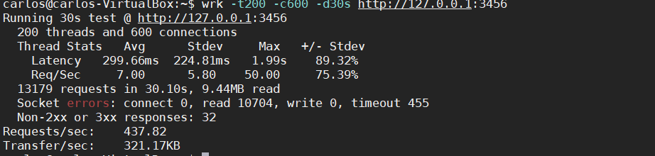
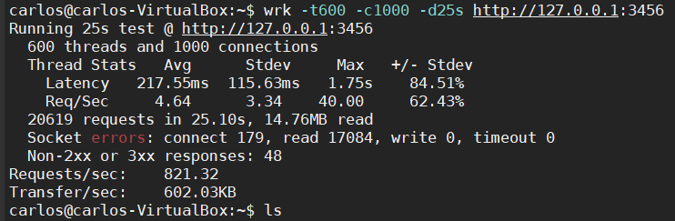

# Testeo de composición
Para testear la composición del docker-compose se ha desarrollado una github action de forma que esto construya el cluster y lance varias peticiones para probar el cluster.

El [fichero](https://github.com/CharlySM/ProyectoCC/blob/master/.github/workflows/tester-docker_compose.yml) se puede ver a continuación.
```
name: Comprobar que docker compose funciona
on: [push,pull_request]
jobs:
  test:
    runs-on: ubuntu-latest
    steps:
      - uses: actions/checkout@v2
      - name: Construye el cluster
        run: docker-compose up -d
      - name: Testea api R
        run: |
          wget 'http://localhost:8000/team?team=Granada' || exit 1
          wget 'http://localhost:8000/manyTeams?team1=Granada&team2=Huesca' || exit 1
      - name: Testea api Ruby
        run: |
          wget 'http://localhost' || exit 1
```

## Testeo de rendimiento.

Para el testeo de rendimiento vamos a usar la herramienta **wrk** de linux para instalarla seguimos la guía que viene en este [enlace.](https://medium.com/@felipedutratine/intelligent-benchmark-with-wrk-163986c1587f)

Ahora vamos a ejecutar varias pruebas para ver el rendimiento del microservicio, para comprobar el rendimiento vamos a usar la aplicación de ruby que es la que mayormente hemos usado durante toda la duración de la asignatura.

- Prueba 1.
  Para la prueba uno hemos lanzado el comando ```wrk -t100 -c400 -d20s --latency http://127.0.0.1:3456```. Esto lanza 100 hebras con 400 conexiones durante 20 segundos.

  

- Prueba 2.
  Para la prueba uno hemos lanzado el comando ```wrk -t200 -c600 -d30s http://127.0.0.1:3456```. Esto lanza 200 hebras con 600 conexiones durante 30 segundos.

  

- Prueba 3.
  Para la prueba uno hemos lanzado el comando ```wrk -t600 -c1000 -d25s http://127.0.0.1:3456```. Esto lanza 600 hebras con 1000 conexiones durante 25 segundos.

  

Después de ver la salida de las pruebas podemos ver que cuantas mas hebras y conexiones le pongamos a nuestra api peor resultado vamos a tener en las pruebas.

[Repositorio de wrk](https://github.com/wg/wrk)
